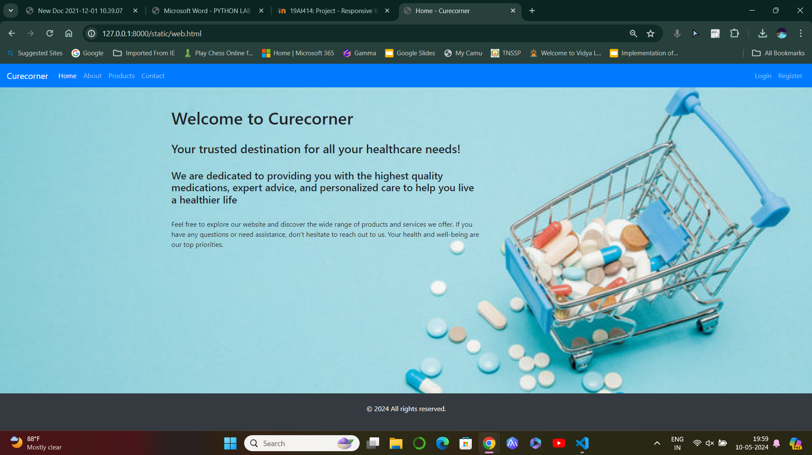
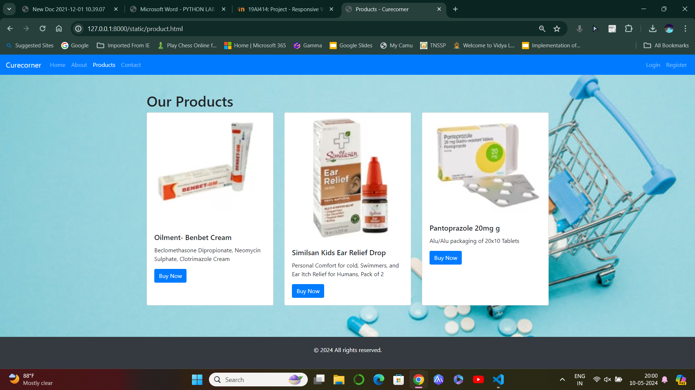

# Project Responsive Web Design using Bootstrap
## Date:10/05/24

## AIM:
To design a responsive website for a Pharmaceutical Company using Bootstrap.


## DESIGN STEPS:

### Step 1:
Clone the repository from GitHub.

### Step 2:
Create Django Admin project.

### Step 3:
Create a New App under the Django Admin project.

### Step 4:
Insert the necessary CSS and JavaScript files as external in order to use Bootstrap.

### Step 5:
Create a HTML file and include the needed Bootstrap components.

### Step 6:
Publish the website in the LocalHost.

## PROGRAM :
```
web.html

<!DOCTYPE html>
<html lang="en">
<head>
  <meta charset="UTF-8">
  <meta name="viewport" content="width=device-width, initial-scale=1.0">
  <title>Home - Curecorner</title>
  <!-- Bootstrap CSS -->
  <link href="https://stackpath.bootstrapcdn.com/bootstrap/4.5.2/css/bootstrap.min.css" rel="stylesheet">
  <!-- Custom CSS -->
  <style>
    body {
      background-image: url('a.jpg');
      background-size: cover;
      background-repeat: no-repeat;
    }
    footer{
      position: fixed;
      left: 0;
      bottom: 0;
      width: 100%;
      background-color: #343a40; 
      color: white;
      text-align: center;
      padding: 10px 0; 
    }
  </style>
</head>
<body>

  <!-- Navbar -->
  <nav class="navbar navbar-expand-lg navbar-dark bg-primary">
    <a class="navbar-brand" href="#">Curecorner</a>
    <button class="navbar-toggler" type="button" data-toggle="collapse" data-target="#navbarSupportedContent" aria-controls="navbarSupportedContent" aria-expanded="false" aria-label="Toggle navigation">
      <span class="navbar-toggler-icon"></span>
    </button>

    <div class="collapse navbar-collapse" id="navbarSupportedContent">
      <ul class="navbar-nav mr-auto">
        <li class="nav-item active">
          <a class="nav-link" href="web.html">Home <span class="sr-only">(current)</span></a>
        </li>
        <li class="nav-item">
          <a class="nav-link" href="about.html">About</a>
        </li>
        <li class="nav-item">
          <a class="nav-link" href="product.html">Products</a>
        </li>
        <li class="nav-item">
          <a class="nav-link" href="contact.html">Contact</a>
        </li>
      </ul>
      <ul class="navbar-nav ml-auto">
        <li class="nav-item">
          <a class="nav-link" href="#">Login</a>
        </li>
        <li class="nav-item">
          <a class="nav-link" href="#">Register</a>
        </li>
      </ul>
    </div>
  </nav>

  <!-- Page Content -->
  <div class="container mt-5">
    <div class="row">
      <div class="col-md-8">
        <h1>Welcome to Curecorner</h1><br>
        <h3>Your trusted destination for all your healthcare needs!</h3><br>
        <h4>We are dedicated to providing you with the highest quality medications, expert advice, and personalized care to help you live a healthier life </h4><br>
        <p>Feel free to explore our website and discover the wide range of products and services we offer. If you have any questions or need assistance, don't hesitate to reach out to us. Your health and well-being are our top priorities.</p>
      </div>
      <div class="col-md-4">
       
      </div>
    </div>
  </div>

  <!-- Footer -->
  <footer class="bg-dark text-white text-center py-4 mt-5">
    <p>&copy; 2024 All rights reserved.</p>
  </footer>

  <!-- Bootstrap JS -->
  <script src="https://code.jquery.com/jquery-3.5.1.slim.min.js"></script>
  <script src="https://cdn.jsdelivr.net/npm/popper.js@1.16.1/dist/umd/popper.min.js"></script>
  <script src="https://stackpath.bootstrapcdn.com/bootstrap/4.5.2/js/bootstrap.min.js"></script>
</body>
</html>
about.html

!DOCTYPE html>
<html lang="en">
<head>
  <meta charset="UTF-8">
  <meta name="viewport" content="width=device-width, initial-scale=1.0">
  <title>About Curecorner</title>
  <!-- Bootstrap CSS -->
  <link href="https://stackpath.bootstrapcdn.com/bootstrap/4.5.2/css/bootstrap.min.css" rel="stylesheet">
  <!-- Custom CSS -->
  <style>
    body {
      background-image: url('a.jpg');
      background-size: cover;
      background-repeat: no-repeat;
    }
    footer{
    position: fixed;
      left: 0;
      bottom: 0;
      width: 100%;
      background-color: #343a40; 
      color: white;
      text-align: center;
      padding: 10px 0; 
    }
  </style>
</head>
<body>

  <!-- Navbar -->
  <nav class="navbar navbar-expand-lg navbar-dark bg-primary">
    <a class="navbar-brand" href="#">urecorner</a>
    <button class="navbar-toggler" type="button" data-toggle="collapse" data-target="#navbarSupportedContent" aria-controls="navbarSupportedContent" aria-expanded="false" aria-label="Toggle navigation">
      <span class="navbar-toggler-icon"></span>
    </button>

    <div class="collapse navbar-collapse" id="navbarSupportedContent">
      <ul class="navbar-nav mr-auto">
        <li class="nav-item">
          <a class="nav-link" href="web.html">Home</a>
        </li>
        <li class="nav-item dropdown active">
          <a class="nav-link dropdown-toggle" href="about.html" id="navbarDropdownAbout" role="button" data-toggle="dropdown" aria-haspopup="true" aria-expanded="false">
            About
          </a>
          <div class="dropdown-menu" aria-labelledby="navbarDropdownAbout">
            <a class="dropdown-item" href="#vision">History</a>
            <a class="dropdown-item" href="#mission">Mission</a>
            <a class="dropdown-item" href="#values">Values</a>
            <!-- Add more subheadings as needed -->
          </div>
        </li>
        <li class="nav-item">
          <a class="nav-link" href="product.html">Products</a>
        </li>
        <li class="nav-item">
          <a class="nav-link" href="#">Contact</a>
        </li>
      </ul>
    </div>
  </nav>

  <!-- Page Content -->
  <div class="container mt-5">
    <div class="row">
      <div class="col-md-12">
        <h1>About Curecorner</h1><br>
        <div id="vision">
          <h2>History</h2>
          <p>Founded in 2005 by Dr. John Smith, Cure Corner has been serving the healthcare needs of our community for over 15 years. What started as a small neighborhood pharmacy has grown into a trusted healthcare destination known for its exceptional service and commitment to patient care.</p>
        </div>
        <div id="mission">
          <h2>Mission</h2>
          <p>At Cure Corner, our mission is to improve the health and well-being of our customers by providing personalized care, quality medications, and reliable healthcare services.</p>
        </div>
        <div id="values">
          <h2>Values</h2>
          <ul>
            <li>Excellence: We are committed to excellence in every aspect of our service. From our knowledgeable staff to our state-of-the-art facilities, we continuously strive for excellence to ensure that you receive the highest standard of care and support..</li>
            <li>Compassion: At CureCorner, compassion is at the heart of everything we do. We understand that behind every prescription, there's a person with unique needs and concerns. </li>
            <li>Innovation: We strive to continuously innovate and improve our products and services to better serve our customers.</li>
            <li>Community: Community is at the heart of CureCorner. We are proud to be part of a vibrant and diverse community, and we are dedicated to making a positive impact. </li>
          </ul>
        </div>
        <!-- Add more subheadings as needed -->
      </div>
    </div>
  </div>

  <!-- Footer -->
  <footer class="bg-dark text-white text-center py-4 mt-5">
    <p>&copy; 2024 All rights reserved.</p>
  </footer>

  <!-- Bootstrap JS -->
  <script src="https://code.jquery.com/jquery-3.5.1.slim.min.js"></script>
  <script src="https://cdn.jsdelivr.net/npm/popper.js@1.16.1/dist/umd/popper.min.js"></script>
  <script src="https://stackpath.bootstrapcdn.com/bootstrap/4.5.2/js/bootstrap.min.js"></script>
</body>
</html>
<!DOCTYPE html>
<html lang="en">
<head>
  <meta charset="UTF-8">
  <meta name="viewport" content="width=device-width, initial-scale=1.0">
  <title>Products - Curecorner</title>
  <!-- Bootstrap CSS -->
  <link href="https://stackpath.bootstrapcdn.com/bootstrap/4.5.2/css/bootstrap.min.css" rel="stylesheet">
  <!-- Custom CSS -->
  <style>
    body {
      background-image: url('a.jpg');
      background-size: cover;
      background-repeat: no-repeat;
    }
    footer{
      position: fixed;
      left: 0;
      bottom: 0;
      width: 100%;
      background-color: #343a40; 
      color: white;
      text-align: center;
      padding: 10px 0; 
    }
  </style>
</head>
<body>

  <!-- Navbar -->
  <nav class="navbar navbar-expand-lg navbar-dark bg-primary">
    <a class="navbar-brand" href="#">Curecorner</a>
    <button class="navbar-toggler" type="button" data-toggle="collapse" data-target="#navbarSupportedContent" aria-controls="navbarSupportedContent" aria-expanded="false" aria-label="Toggle navigation">
      <span class="navbar-toggler-icon"></span>
    </button>

    <div class="collapse navbar-collapse" id="navbarSupportedContent">
      <ul class="navbar-nav mr-auto">
        <li class="nav-item">
          <a class="nav-link" href="web.html">Home</a>
        </li>
        <li class="nav-item">
          <a class="nav-link" href="about.html">About</a>
        </li>
        <li class="nav-item active">
          <a class="nav-link" href="product.html">Products <span class="sr-only">(current)</span></a>
        </li>
        <li class="nav-item">
          <a class="nav-link" href="contact.html">Contact</a>
        </li>
      </ul>
      <ul class="navbar-nav ml-auto">
        <li class="nav-item">
          <a class="nav-link" href="#">Login</a>
        </li>
        <li class="nav-item">
          <a class="nav-link" href="#">Register</a>
        </li>
      </ul>
    </div>
  </nav>

  <!-- Page Content -->
  <div class="container mt-5">
    <div class="row">
      <div class="col-md-12">
        <h1>Our Products</h1>
        <div class="card-deck">
          <div class="card">
            
            <div class="card-body">
              <h5 class="card-title">Oilment- Benbet Cream</h5>
              <p class="card-text">Beclomethasone Dipropionate, Neomycin Sulphate, Clotrimazole Cream</p>
              <a href="#" class="btn btn-primary">Buy Now</a>
            </div>
          </div>
          <div class="card">
            
            <div class="card-body">
              <h5 class="card-title">Similsan Kids Ear Relief Drop</h5>
              <p class="card-text"> Personal Comfort for cold, Swimmers, and Ear Itch Relief for Humans, Pack of 2</p>
              <a href="#" class="btn btn-primary">Buy Now</a>
            </div>
          </div>
          <div class="card">
            
            <div class="card-body">
              <h5 class="card-title">Pantoprazole 20mg g</h5>
              <p class="card-text">Alu/Alu packaging of 20x10 Tablets</p>
              <a href="#" class="btn btn-primary">Buy Now</a>
            </div>
          </div>
        </div>
      </div>
    </div>
  </div>

  <!-- Footer -->
  <footer class="bg-dark text-white text-center py-4 mt-5">
    <p>&copy; 2024 All rights reserved.</p>
  </footer>

  <!-- Bootstrap JS -->
  <script src="https://code.jquery.com/jquery-3.5.1.slim.min.js"></script>
  <script src="https://cdn.jsdelivr.net/npm/popper.js@1.16.1/dist/umd/popper.min.js"></script>
  <script src="https://stackpath.bootstrapcdn.com/bootstrap/4.5.2/js/bootstrap.min.js"></script>
</body>
</html>
contact.html

<!DOCTYPE html>
<html lang="en">
<head>
  <meta charset="UTF-8">
  <meta name="viewport" content="width=device-width, initial-scale=1.0">
  <title>Contact Us - Curecorner</title>
  <!-- Bootstrap CSS -->
  <link href="https://stackpath.bootstrapcdn.com/bootstrap/4.5.2/css/bootstrap.min.css" rel="stylesheet">
  <!-- Custom CSS -->
  <style>
    body {
      background-image: url('a.jpg');
      background-size: cover;
      background-repeat: no-repeat;
    }
    footer{
      position: fixed;
      left: 0;
      bottom: 0;
      width: 100%;
      background-color: #306090; 
      color: white;
      text-align: center;
      padding: 10px 0; 
    }
  </style>
</head>
<body>

  <!-- Navbar -->
  <nav class="navbar navbar-expand-lg navbar-dark bg-primary">
    <a class="navbar-brand" href="#">Curecorner</a>
    <button class="navbar-toggler" type="button" data-toggle="collapse" data-target="#navbarSupportedContent" aria-controls="navbarSupportedContent" aria-expanded="false" aria-label="Toggle navigation">
      <span class="navbar-toggler-icon"></span>
    </button>

    <div class="collapse navbar-collapse" id="navbarSupportedContent">
      <ul class="navbar-nav mr-auto">
        <li class="nav-item">
          <a class="nav-link" href="web.html">Home</a>
        </li>
        <li class="nav-item">
          <a class="nav-link" href="about.html">About</a>
        </li>
        <li class="nav-item">
          <a class="nav-link" href="product.html">Products</a>
        </li>
        <li class="nav-item active">
          <a class="nav-link" href="contact.html">Contact <span class="sr-only">(current)</span></a>
        </li>
      </ul>
    </div>
  </nav>

  <!-- Page Content -->
  <div class="container mt-5">
    <div class="row">
      <div class="col-md-8">
        <h1>Contact Us</h1>
        <p>For any inquiries or feedback, please fill out the form below and we will get back to you as soon as possible.</p>
        <form>
          <div class="form-group">
            <label for="name">Your Name</label>
            <input type="text" class="form-control" id="name" placeholder="Enter your name">
          </div>
          <div class="form-group">
            <label for="email">Your Email</label>
            <input type="email" class="form-control" id="email" placeholder="Enter your email">
          </div>
          <div class="form-group">
            <label for="message">Queries</label>
            <textarea class="form-control" id="message" rows="5" placeholder="Enter your message"></textarea>
          </div>
          <button type="submit" class="btn btn-primary">Submit</button>
        </form>
      </div>
      <div class="col-md-4">
        <h2>Curecorner</h2>
        <address>
          <strong>Address:</strong><br>
          no:205, Medcentre complex, Mumbai<br>
          India, 630091<br><br>
          <strong>Mail us:</strong><br>
          info@Curenow.com<br><br>
          <strong>Phone:</strong><br>
          +144-22021785
        </address>
      </div>
    </div>
  </div>

  <!-- Footer -->
  <footer class="bg-dark text-white text-center py-4 mt-5">
    <p>&copy; 2024 All rights reserved.</p>
  </footer>

  <!-- Bootstrap JS -->
  <script src="https://code.jquery.com/jquery-3.5.1.slim.min.js"></script>
  <script src="https://cdn.jsdelivr.net/npm/popper.js@1.16.1/dist/umd/popper.min.js"></script>
  <script src="https://stackpath.bootstrapcdn.com/bootstrap/4.5.2/js/bootstrap.min.js"></script>
</body>
</html>
```

## OUTPUT:




## RESULT:
The Project for responsive web design using Bootstrap is completed successfully.
